# Bộ sơ đồ thiết kế (Mermaid — hiển thị trực tiếp trên GitHub)

Mỗi sơ đồ dưới đây có bản PlantUML (chuẩn UML, cùng tên trong thư mục này) để xuất ảnh chất lượng in
(`./render.sh`), và bản PNG kiến trúc dựng bằng Graphviz trong [out/](out/) (`./render-dot.sh`).

**Mục lục:**
1. [C4 ngữ cảnh](#1-c4-mức-1--ngữ-cảnh)
2. [C4 container](#2-c4-mức-2--container)
3. [C4 thành phần order](#3-c4-mức-3--thành-phần-order-service)
4. [Use case người mua](#4-use-case--người-mua)
5. [Use case người bán & admin](#5-use-case--người-bán--quản-trị)
6. [Use case nền tảng](#6-use-case--nền-tảng-devsecops--aiops)
7. [Lớp miền](#7-biểu-đồ-lớp-miền)
8. [ERD](#8-erd-database-per-service)
9. Tuần tự: [checkout COD](#9-tuần-tự--checkout-cod-saga) · [thanh toán lỗi](#10-tuần-tự--thanh-toán-lỗi--bù-trừ) · [xác thực](#11-tuần-tự--xác-thực--refresh-xoay-vòng) · [đăng sản phẩm](#12-tuần-tự--mở-shop--đăng-sản-phẩm) · [CI/CD GitOps](#13-tuần-tự--cicd--gitops) · [canary](#14-tuần-tự--canary) · [sự cố AIOps](#15-tuần-tự--tác-tử-aiops)
10. Hoạt động: [checkout](#16-hoạt-động--đặt-hàng) · [huỷ/trả](#17-hoạt-động--huỷ--trả-hàng) · [CI](#18-hoạt-động--pipeline-ci) · [AIOps](#19-hoạt-động--vòng-lặp-aiops)
11. Trạng thái: [đơn hàng](#20-trạng-thái--đơn-hàng) · [thanh toán/vận đơn/kho/sản phẩm/shop](#21-trạng-thái--thanh-toán-vận-đơn-giữ-kho-sản-phẩm-shop) · [sự cố](#22-trạng-thái--sự-cố-aiops)
12. Triển khai: [hybrid](#23-triển-khai--hybrid) · [AWS](#24-triển-khai--aws) · [on-prem](#25-triển-khai--on-prem)
13. [Mạng & bảo mật](#26-mạng--bảo-mật) · [Kafka](#27-topo-sự-kiện-kafka) · [Quan sát](#28-đường-ống-quan-sát) · [Gantt](#29-kế-hoạch-gantt) · [Mindmap](#30-bản-đồ-công-nghệ)

---

## 1. C4 mức 1 — Ngữ cảnh
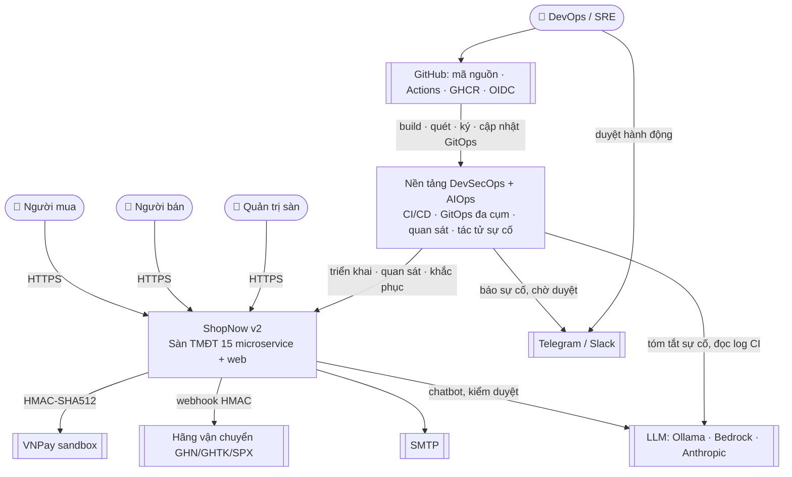
```mermaid
flowchart TB
  buyer(["👤 Người mua"]) -->|HTTPS| shopnow
  seller(["👤 Người bán"]) -->|HTTPS| shopnow
  admin(["👤 Quản trị sàn"]) -->|HTTPS| shopnow
  sre(["👤 DevOps / SRE"]) --> github
  shopnow["ShopNow v2<br/>Sàn TMĐT 15 microservice + web"]
  platform["Nền tảng DevSecOps + AIOps<br/>CI/CD · GitOps đa cụm · quan sát · tác tử sự cố"]
  github[["GitHub: mã nguồn · Actions · GHCR · OIDC"]]
  vnpay[["VNPay sandbox"]]
  carrier[["Hãng vận chuyển GHN/GHTK/SPX"]]
  smtp[["SMTP"]]
  llm[["LLM: Ollama · Bedrock · Anthropic"]]
  chat[["Telegram / Slack"]]
  shopnow -->|HMAC-SHA512| vnpay
  shopnow -->|webhook HMAC| carrier
  shopnow --> smtp
  shopnow -->|chatbot, kiểm duyệt| llm
  github -->|build · quét · ký · cập nhật GitOps| platform
  platform -->|triển khai · quan sát · khắc phục| shopnow
  platform -->|báo sự cố, chờ duyệt| chat
  platform -->|tóm tắt sự cố, đọc log CI| llm
  sre -->|duyệt hành động| chat
```

## 2. C4 mức 2 — Container
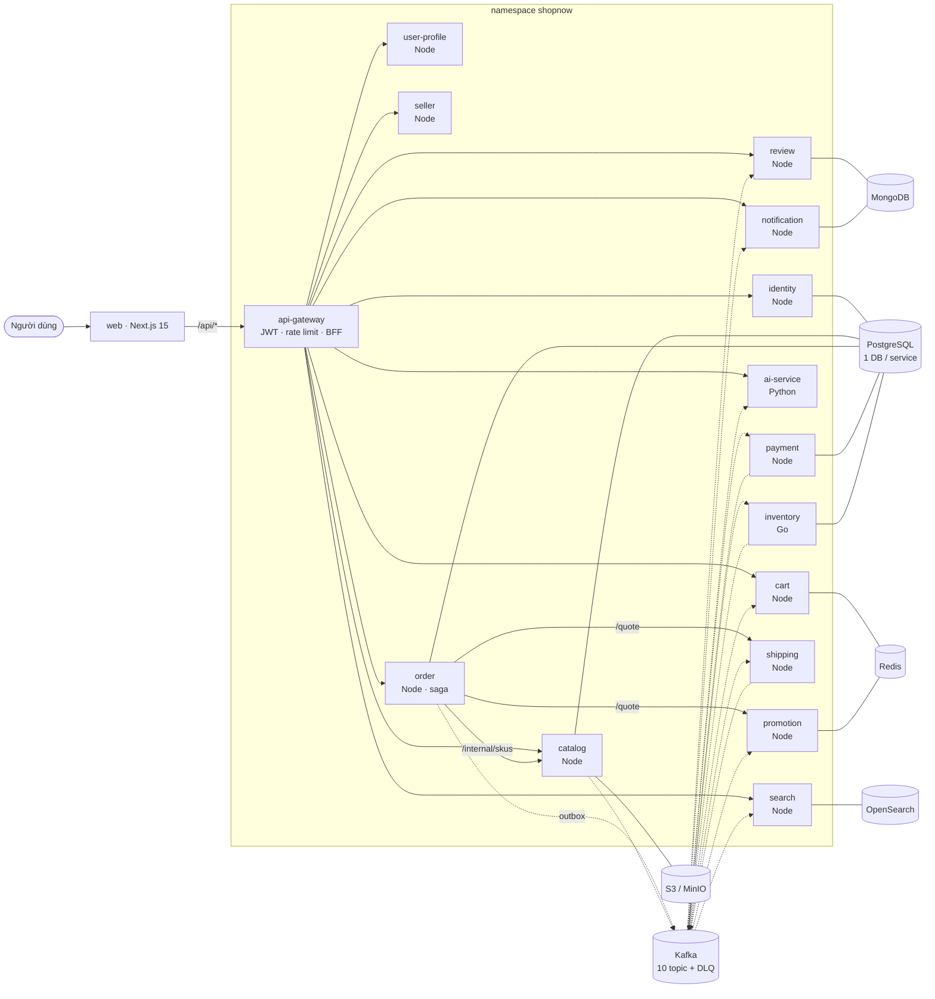
```mermaid
flowchart LR
  user(["Người dùng"]) --> web["web · Next.js 15"]
  web -->|/api/*| gw["api-gateway<br/>JWT · rate limit · BFF"]
  subgraph svc["namespace shopnow"]
    gw --> identity["identity<br/>Node"] & profile["user-profile<br/>Node"] & seller["seller<br/>Node"] & catalog["catalog<br/>Node"] & search["search<br/>Node"] & cart["cart<br/>Node"] & order["order<br/>Node · saga"] & review["review<br/>Node"] & notif["notification<br/>Node"] & ai["ai-service<br/>Python"]
    inventory["inventory<br/>Go"]
    promo["promotion<br/>Node"]
    payment["payment<br/>Node"]
    shipping["shipping<br/>Node"]
  end
  order -->|/internal/skus| catalog
  order -->|/quote| promo
  order -->|/quote| shipping
  K[("Kafka<br/>10 topic + DLQ")]
  order -. outbox .-> K
  K -.-> inventory & payment & shipping & notif & search & cart & promo & review & ai
  inventory -.-> K
  payment -.-> K
  shipping -.-> K
  catalog -.-> K
  PG[("PostgreSQL<br/>1 DB / service")]
  R[("Redis")]
  M[("MongoDB")]
  OS[("OpenSearch")]
  S3[("S3 / MinIO")]
  identity & catalog & order & payment & inventory --- PG
  cart & promo --- R
  review & notif --- M
  search --- OS
  catalog --- S3
```

## 3. C4 mức 3 — Thành phần order-service
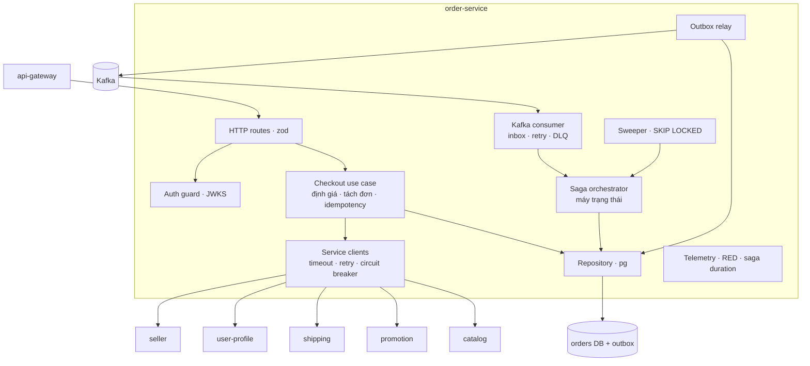
```mermaid
flowchart TB
  gw["api-gateway"] --> routes
  subgraph order["order-service"]
    routes["HTTP routes · zod"] --> auth["Auth guard · JWKS"]
    routes --> checkout["Checkout use case<br/>định giá · tách đơn · idempotency"]
    checkout --> clients["Service clients<br/>timeout · retry · circuit breaker"]
    checkout --> repo["Repository · pg"]
    consumer["Kafka consumer<br/>inbox · retry · DLQ"] --> saga["Saga orchestrator<br/>máy trạng thái"]
    sweeper["Sweeper · SKIP LOCKED"] --> saga
    saga --> repo
    relay["Outbox relay"] --> repo
    metrics["Telemetry · RED · saga duration"]
  end
  clients --> catalog["catalog"] & promo["promotion"] & ship["shipping"] & profile["user-profile"] & sellerS["seller"]
  repo --> db[("orders DB + outbox")]
  relay --> kafka[("Kafka")]
  kafka --> consumer
```

## 4. Use case — Người mua
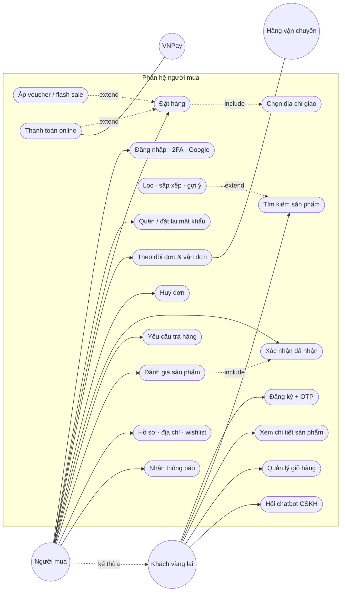
```mermaid
flowchart LR
  guest(("Khách vãng lai"))
  buyer(("Người mua"))
  vnpay(("VNPay"))
  carrier(("Hãng vận chuyển"))
  buyer -. kế thừa .-> guest
  subgraph uc["Phân hệ người mua"]
    U1(["Đăng ký + OTP"])
    U2(["Đăng nhập · 2FA · Google"])
    U3(["Quên / đặt lại mật khẩu"])
    U4(["Tìm kiếm sản phẩm"])
    U4a(["Lọc · sắp xếp · gợi ý"])
    U5(["Xem chi tiết sản phẩm"])
    U6(["Quản lý giỏ hàng"])
    U7(["Đặt hàng"])
    U7a(["Áp voucher / flash sale"])
    U7b(["Chọn địa chỉ giao"])
    U8(["Thanh toán online"])
    U9(["Theo dõi đơn & vận đơn"])
    U10(["Huỷ đơn"])
    U11(["Xác nhận đã nhận"])
    U12(["Yêu cầu trả hàng"])
    U13(["Đánh giá sản phẩm"])
    U14(["Hồ sơ · địa chỉ · wishlist"])
    U16(["Nhận thông báo"])
    U17(["Hỏi chatbot CSKH"])
  end
  guest --> U1 & U4 & U5 & U6 & U17
  buyer --> U2 & U3 & U7 & U9 & U10 & U11 & U12 & U13 & U14 & U16
  U4a -. extend .-> U4
  U7 -. include .-> U7b
  U7a -. extend .-> U7
  U8 -. extend .-> U7
  U8 --- vnpay
  U9 --- carrier
  U13 -. include .-> U11
```

## 5. Use case — Người bán & Quản trị
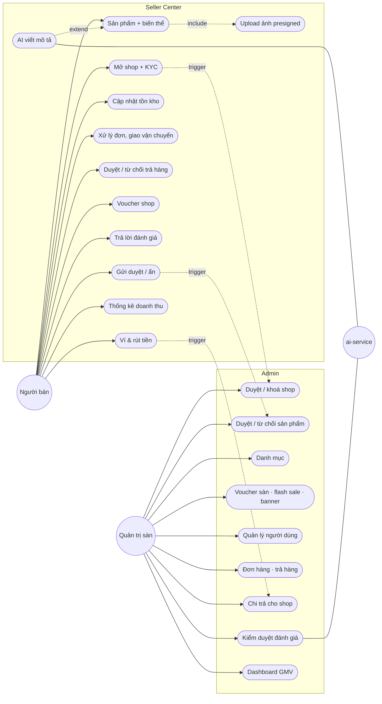
```mermaid
flowchart LR
  seller(("Người bán"))
  admin(("Quản trị sàn"))
  ai(("ai-service"))
  subgraph sc["Seller Center"]
    S1(["Mở shop + KYC"])
    S2(["Sản phẩm + biến thể"])
    S2a(["Upload ảnh presigned"])
    S2b(["AI viết mô tả"])
    S3(["Gửi duyệt / ẩn"])
    S4(["Cập nhật tồn kho"])
    S5(["Xử lý đơn, giao vận chuyển"])
    S6(["Duyệt / từ chối trả hàng"])
    S7(["Voucher shop"])
    S8(["Trả lời đánh giá"])
    S9(["Ví & rút tiền"])
    S10(["Thống kê doanh thu"])
  end
  subgraph ad["Admin"]
    A1(["Duyệt / khoá shop"])
    A2(["Duyệt / từ chối sản phẩm"])
    A3(["Danh mục"])
    A4(["Voucher sàn · flash sale · banner"])
    A6(["Quản lý người dùng"])
    A7(["Đơn hàng · trả hàng"])
    A8(["Chi trả cho shop"])
    A9(["Kiểm duyệt đánh giá"])
    A10(["Dashboard GMV"])
  end
  seller --> S1 & S2 & S3 & S4 & S5 & S6 & S7 & S8 & S9 & S10
  admin --> A1 & A2 & A3 & A4 & A6 & A7 & A8 & A9 & A10
  S2 -. include .-> S2a
  S2b -. extend .-> S2
  S2b --- ai
  A9 --- ai
  S1 -. trigger .-> A1
  S3 -. trigger .-> A2
  S9 -. trigger .-> A8
```

## 6. Use case — Nền tảng DevSecOps + AIOps
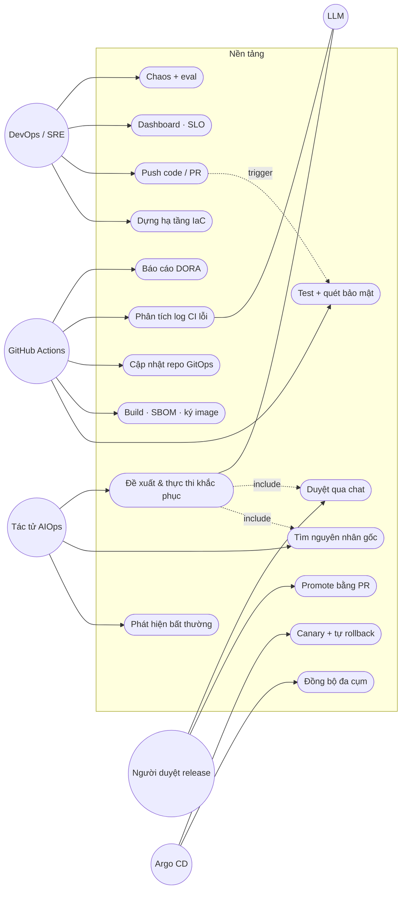
```mermaid
flowchart LR
  sre(("DevOps / SRE"))
  appr(("Người duyệt release"))
  ci(("GitHub Actions"))
  cd(("Argo CD"))
  agent(("Tác tử AIOps"))
  llm(("LLM"))
  subgraph p["Nền tảng"]
    P1(["Dựng hạ tầng IaC"])
    P2(["Push code / PR"])
    P3(["Test + quét bảo mật"])
    P4(["Build · SBOM · ký image"])
    P5(["Cập nhật repo GitOps"])
    P6(["Đồng bộ đa cụm"])
    P7(["Canary + tự rollback"])
    P8(["Promote bằng PR"])
    P9(["Dashboard · SLO"])
    P10(["Phát hiện bất thường"])
    P11(["Tìm nguyên nhân gốc"])
    P12(["Đề xuất & thực thi khắc phục"])
    P13(["Duyệt qua chat"])
    P14(["Phân tích log CI lỗi"])
    P15(["Chaos + eval"])
    P16(["Báo cáo DORA"])
  end
  sre --> P1 & P2 & P9 & P15
  appr --> P8 & P13
  ci --> P3 & P4 & P5 & P14 & P16
  cd --> P6 & P7
  agent --> P10 & P11 & P12
  P2 -. trigger .-> P3
  P12 -. include .-> P11
  P12 -. include .-> P13
  P12 --- llm
  P14 --- llm
```

## 7. Biểu đồ lớp miền
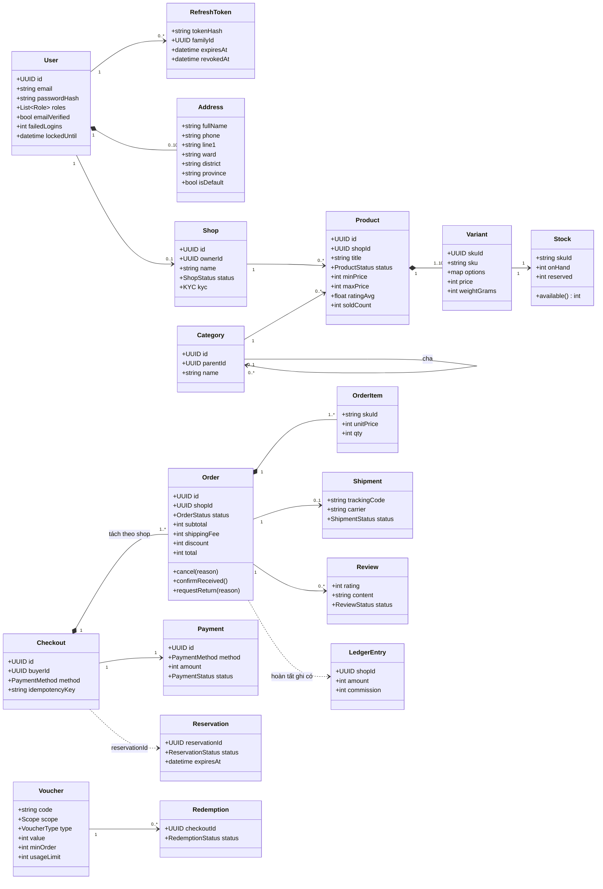
```mermaid
classDiagram
  direction LR
  class User {
    +UUID id
    +string email
    +string passwordHash
    +List~Role~ roles
    +bool emailVerified
    +int failedLogins
    +datetime lockedUntil
  }
  class RefreshToken {
    +string tokenHash
    +UUID familyId
    +datetime expiresAt
    +datetime revokedAt
  }
  class Address {
    +string fullName
    +string phone
    +string line1
    +string ward
    +string district
    +string province
    +bool isDefault
  }
  class Shop {
    +UUID id
    +UUID ownerId
    +string name
    +ShopStatus status
    +KYC kyc
  }
  class Category {
    +UUID id
    +UUID parentId
    +string name
  }
  class Product {
    +UUID id
    +UUID shopId
    +string title
    +ProductStatus status
    +int minPrice
    +int maxPrice
    +float ratingAvg
    +int soldCount
  }
  class Variant {
    +UUID skuId
    +string sku
    +map options
    +int price
    +int weightGrams
  }
  class Stock {
    +string skuId
    +int onHand
    +int reserved
    +available() int
  }
  class Reservation {
    +UUID reservationId
    +ReservationStatus status
    +datetime expiresAt
  }
  class Voucher {
    +string code
    +Scope scope
    +VoucherType type
    +int value
    +int minOrder
    +int usageLimit
  }
  class Redemption {
    +UUID checkoutId
    +RedemptionStatus status
  }
  class Checkout {
    +UUID id
    +UUID buyerId
    +PaymentMethod method
    +string idempotencyKey
  }
  class Order {
    +UUID id
    +UUID shopId
    +OrderStatus status
    +int subtotal
    +int shippingFee
    +int discount
    +int total
    +cancel(reason)
    +confirmReceived()
    +requestReturn(reason)
  }
  class OrderItem {
    +string skuId
    +int unitPrice
    +int qty
  }
  class Payment {
    +UUID id
    +PaymentMethod method
    +int amount
    +PaymentStatus status
  }
  class LedgerEntry {
    +UUID shopId
    +int amount
    +int commission
  }
  class Shipment {
    +string trackingCode
    +string carrier
    +ShipmentStatus status
  }
  class Review {
    +int rating
    +string content
    +ReviewStatus status
  }
  User "1" --> "0..*" RefreshToken
  User "1" *-- "0..10" Address
  User "1" --> "0..1" Shop
  Category "1" --> "0..*" Product
  Category "0..1" --> "0..*" Category : cha
  Shop "1" --> "0..*" Product
  Product "1" *-- "1..100" Variant
  Variant "1" --> "1" Stock
  Checkout "1" *-- "1..*" Order : tách theo shop
  Order "1" *-- "1..*" OrderItem
  Checkout "1" --> "1" Payment
  Checkout ..> Reservation : reservationId
  Order "1" --> "0..1" Shipment
  Order "1" --> "0..*" Review
  Voucher "1" --> "0..*" Redemption
  Order ..> LedgerEntry : hoàn tất ghi có
```

## 8. ERD (database-per-service)
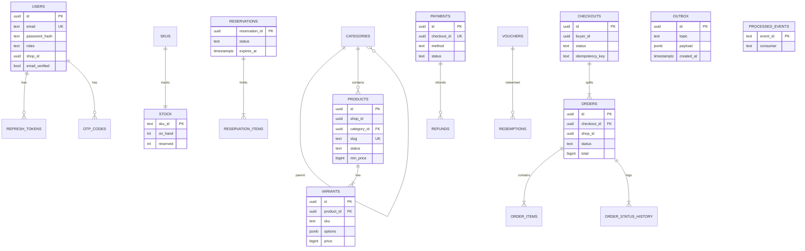
```mermaid
erDiagram
  USERS ||--o{ REFRESH_TOKENS : has
  USERS ||--o{ OTP_CODES : has
  CATEGORIES ||--o{ CATEGORIES : parent
  CATEGORIES ||--o{ PRODUCTS : contains
  PRODUCTS ||--|{ VARIANTS : has
  SKUS ||--|| STOCK : tracks
  RESERVATIONS ||--|{ RESERVATION_ITEMS : holds
  CHECKOUTS ||--|{ ORDERS : splits
  ORDERS ||--|{ ORDER_ITEMS : contains
  ORDERS ||--|{ ORDER_STATUS_HISTORY : logs
  PAYMENTS ||--o{ REFUNDS : refunds
  VOUCHERS ||--o{ REDEMPTIONS : redeemed
  USERS {
    uuid id PK
    text email UK
    text password_hash
    text roles
    uuid shop_id
    bool email_verified
  }
  PRODUCTS {
    uuid id PK
    uuid shop_id
    uuid category_id FK
    text slug UK
    text status
    bigint min_price
  }
  VARIANTS {
    uuid id PK
    uuid product_id FK
    text sku
    jsonb options
    bigint price
  }
  STOCK {
    text sku_id PK
    int on_hand
    int reserved
  }
  RESERVATIONS {
    uuid reservation_id PK
    text status
    timestamptz expires_at
  }
  CHECKOUTS {
    uuid id PK
    uuid buyer_id
    text status
    text idempotency_key
  }
  ORDERS {
    uuid id PK
    uuid checkout_id FK
    uuid shop_id
    text status
    bigint total
  }
  PAYMENTS {
    uuid id PK
    uuid checkout_id UK
    text method
    text status
  }
  OUTBOX {
    uuid id PK
    text topic
    jsonb payload
    timestamptz created_at
  }
  PROCESSED_EVENTS {
    text event_id PK
    text consumer
  }
```

## 9. Tuần tự — Checkout COD (saga)
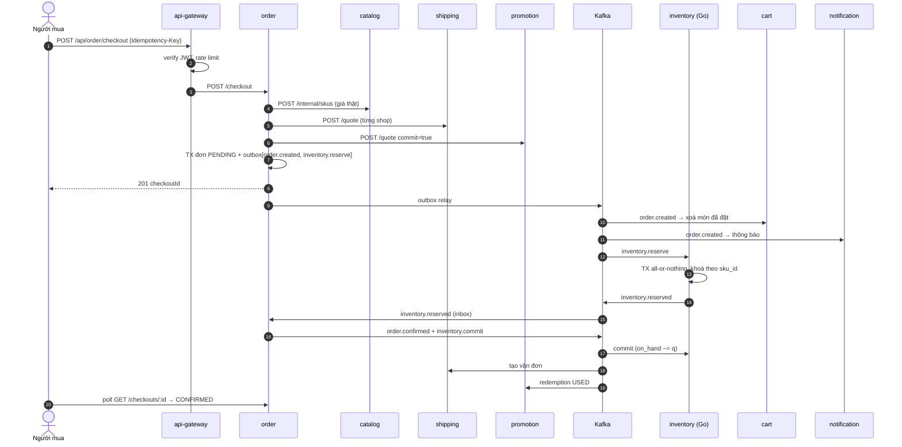
```mermaid
sequenceDiagram
  autonumber
  actor B as Người mua
  participant G as api-gateway
  participant O as order
  participant C as catalog
  participant S as shipping
  participant P as promotion
  participant K as Kafka
  participant I as inventory (Go)
  participant CA as cart
  participant N as notification
  B->>G: POST /api/order/checkout (Idempotency-Key)
  G->>G: verify JWT, rate limit
  G->>O: POST /checkout
  O->>C: POST /internal/skus (giá thật)
  O->>S: POST /quote (từng shop)
  O->>P: POST /quote commit=true
  O->>O: TX đơn PENDING + outbox[order.created, inventory.reserve]
  O-->>B: 201 checkoutId
  O->>K: outbox relay
  K->>CA: order.created → xoá món đã đặt
  K->>N: order.created → thông báo
  K->>I: inventory.reserve
  I->>I: TX all-or-nothing, khoá theo sku_id
  I->>K: inventory.reserved
  K->>O: inventory.reserved (inbox)
  O->>K: order.confirmed + inventory.commit
  K->>I: commit (on_hand −= q)
  K->>S: tạo vận đơn
  K->>P: redemption USED
  B->>O: poll GET /checkouts/:id → CONFIRMED
```

## 10. Tuần tự — Thanh toán lỗi → bù trừ
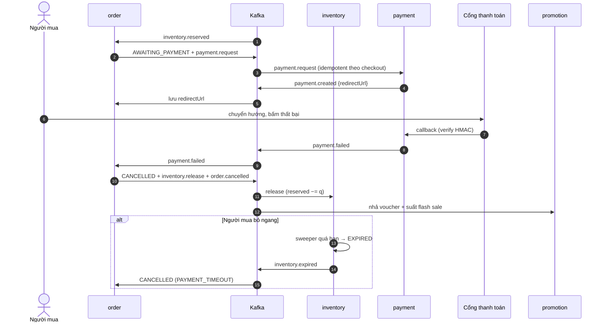
```mermaid
sequenceDiagram
  autonumber
  actor B as Người mua
  participant O as order
  participant K as Kafka
  participant I as inventory
  participant PAY as payment
  participant GW as Cổng thanh toán
  participant P as promotion
  K->>O: inventory.reserved
  O->>K: AWAITING_PAYMENT + payment.request
  K->>PAY: payment.request (idempotent theo checkout)
  PAY->>K: payment.created {redirectUrl}
  K->>O: lưu redirectUrl
  B->>GW: chuyển hướng, bấm thất bại
  GW->>PAY: callback (verify HMAC)
  PAY->>K: payment.failed
  K->>O: payment.failed
  O->>K: CANCELLED + inventory.release + order.cancelled
  K->>I: release (reserved −= q)
  K->>P: nhả voucher + suất flash sale
  alt Người mua bỏ ngang
    I->>I: sweeper quá hạn → EXPIRED
    I->>K: inventory.expired
    K->>O: CANCELLED (PAYMENT_TIMEOUT)
  end
```

## 11. Tuần tự — Xác thực & refresh xoay vòng
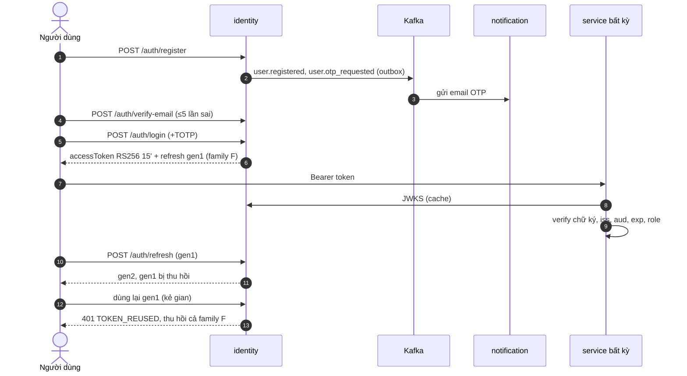
```mermaid
sequenceDiagram
  autonumber
  actor U as Người dùng
  participant ID as identity
  participant K as Kafka
  participant N as notification
  participant SVC as service bất kỳ
  U->>ID: POST /auth/register
  ID->>K: user.registered, user.otp_requested (outbox)
  K->>N: gửi email OTP
  U->>ID: POST /auth/verify-email (≤5 lần sai)
  U->>ID: POST /auth/login (+TOTP)
  ID-->>U: accessToken RS256 15' + refresh gen1 (family F)
  U->>SVC: Bearer token
  SVC->>ID: JWKS (cache)
  SVC->>SVC: verify chữ ký, iss, aud, exp, role
  U->>ID: POST /auth/refresh (gen1)
  ID-->>U: gen2, gen1 bị thu hồi
  U->>ID: dùng lại gen1 (kẻ gian)
  ID-->>U: 401 TOKEN_REUSED, thu hồi cả family F
```

## 12. Tuần tự — Mở shop & đăng sản phẩm
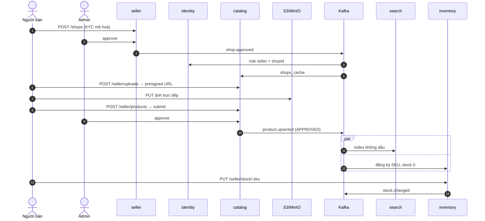
```mermaid
sequenceDiagram
  autonumber
  actor S as Người bán
  actor A as Admin
  participant SE as seller
  participant ID as identity
  participant C as catalog
  participant S3 as S3/MinIO
  participant K as Kafka
  participant SR as search
  participant I as inventory
  S->>SE: POST /shops (KYC mã hoá)
  A->>SE: approve
  SE->>K: shop.approved
  K->>ID: role seller + shopId
  K->>C: shops_cache
  S->>C: POST /seller/uploads → presigned URL
  S->>S3: PUT ảnh trực tiếp
  S->>C: POST /seller/products → submit
  A->>C: approve
  C->>K: product.upserted (APPROVED)
  par
    K->>SR: index không dấu
  and
    K->>I: đăng ký SKU, stock 0
  end
  S->>I: PUT /seller/stock/:sku
  I->>K: stock.changed
```

## 13. Tuần tự — CI/CD → GitOps
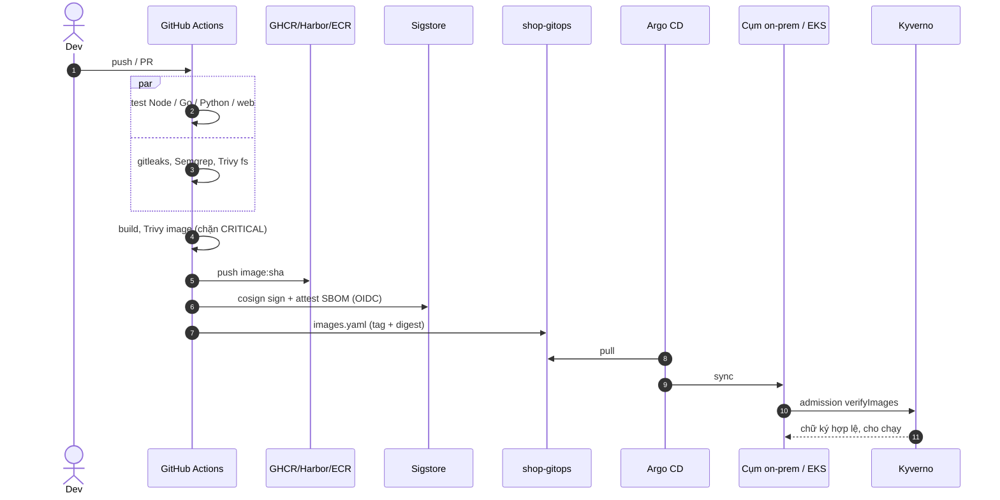
```mermaid
sequenceDiagram
  autonumber
  actor Dev
  participant CI as GitHub Actions
  participant REG as GHCR/Harbor/ECR
  participant SIG as Sigstore
  participant GO as shop-gitops
  participant ARGO as Argo CD
  participant K8S as Cụm on-prem / EKS
  participant KY as Kyverno
  Dev->>CI: push / PR
  par
    CI->>CI: test Node / Go / Python / web
  and
    CI->>CI: gitleaks, Semgrep, Trivy fs
  end
  CI->>CI: build, Trivy image (chặn CRITICAL)
  CI->>REG: push image:sha
  CI->>SIG: cosign sign + attest SBOM (OIDC)
  CI->>GO: images.yaml (tag + digest)
  ARGO->>GO: pull
  ARGO->>K8S: sync
  K8S->>KY: admission verifyImages
  KY-->>K8S: chữ ký hợp lệ, cho chạy
```

## 14. Tuần tự — Canary
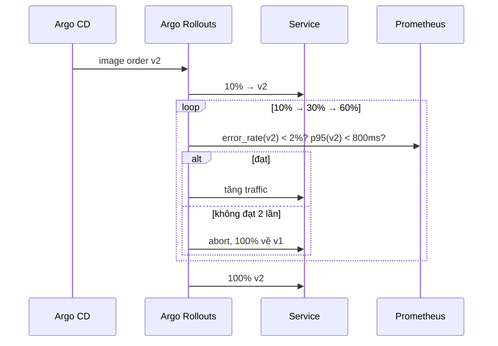
```mermaid
sequenceDiagram
  participant A as Argo CD
  participant R as Argo Rollouts
  participant SVC as Service
  participant P as Prometheus
  A->>R: image order v2
  R->>SVC: 10% → v2
  loop 10% → 30% → 60%
    R->>P: error_rate(v2) < 2%? p95(v2) < 800ms?
    alt đạt
      R->>SVC: tăng traffic
    else không đạt 2 lần
      R->>SVC: abort, 100% về v1
    end
  end
  R->>SVC: 100% v2
```

## 15. Tuần tự — Tác tử AIOps
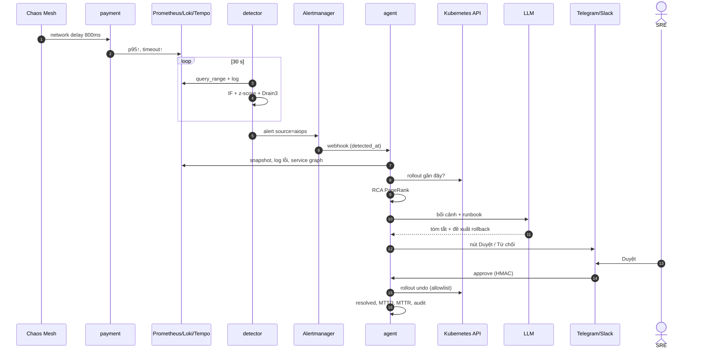
```mermaid
sequenceDiagram
  autonumber
  participant CH as Chaos Mesh
  participant PAY as payment
  participant OBS as Prometheus/Loki/Tempo
  participant DET as detector
  participant AM as Alertmanager
  participant AG as agent
  participant K8S as Kubernetes API
  participant LLM as LLM
  participant CHAT as Telegram/Slack
  actor SRE
  CH->>PAY: network delay 800ms
  PAY->>OBS: p95↑, timeout↑
  loop 30 s
    DET->>OBS: query_range + log
    DET->>DET: IF + z-score + Drain3
  end
  DET->>AM: alert source=aiops
  AM->>AG: webhook (detected_at)
  AG->>OBS: snapshot, log lỗi, service graph
  AG->>K8S: rollout gần đây?
  AG->>AG: RCA PageRank
  AG->>LLM: bối cảnh + runbook
  LLM-->>AG: tóm tắt + đề xuất rollback
  AG->>CHAT: nút Duyệt / Từ chối
  SRE->>CHAT: Duyệt
  CHAT->>AG: approve (HMAC)
  AG->>K8S: rollout undo (allowlist)
  AG->>AG: resolved, MTTD, MTTR, audit
```

## 16. Hoạt động — Đặt hàng
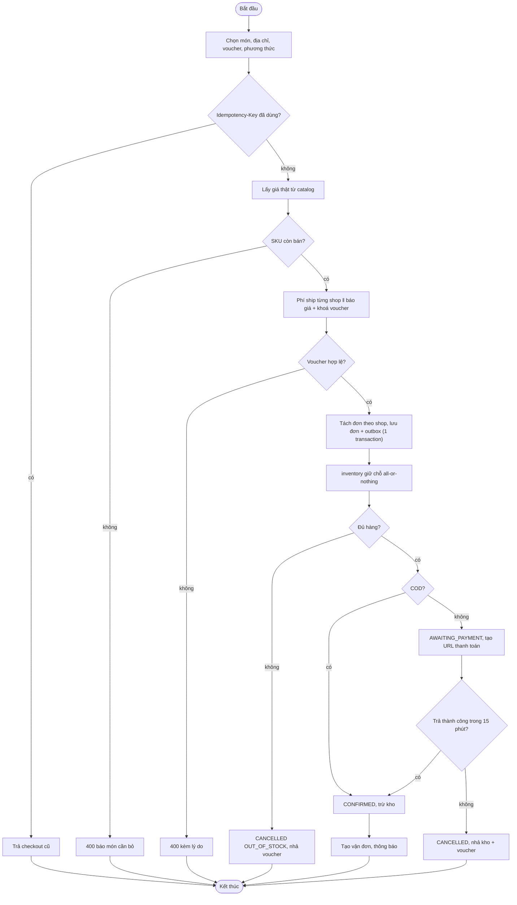
```mermaid
flowchart TD
  a([Bắt đầu]) --> b["Chọn món, địa chỉ, voucher, phương thức"]
  b --> c{"Idempotency-Key đã dùng?"}
  c -- có --> c1["Trả checkout cũ"] --> z([Kết thúc])
  c -- không --> d["Lấy giá thật từ catalog"]
  d --> e{"SKU còn bán?"}
  e -- không --> e1["400 báo món cần bỏ"] --> z
  e -- có --> f["Phí ship từng shop ‖ báo giá + khoá voucher"]
  f --> g{"Voucher hợp lệ?"}
  g -- không --> g1["400 kèm lý do"] --> z
  g -- có --> h["Tách đơn theo shop, lưu đơn + outbox (1 transaction)"]
  h --> i["inventory giữ chỗ all-or-nothing"]
  i --> j{"Đủ hàng?"}
  j -- không --> j1["CANCELLED OUT_OF_STOCK, nhả voucher"] --> z
  j -- có --> k{"COD?"}
  k -- có --> l["CONFIRMED, trừ kho"]
  k -- không --> m["AWAITING_PAYMENT, tạo URL thanh toán"]
  m --> n{"Trả thành công trong 15 phút?"}
  n -- có --> l
  n -- không --> n1["CANCELLED, nhả kho + voucher"] --> z
  l --> o["Tạo vận đơn, thông báo"] --> z
```

## 17. Hoạt động — Huỷ & trả hàng
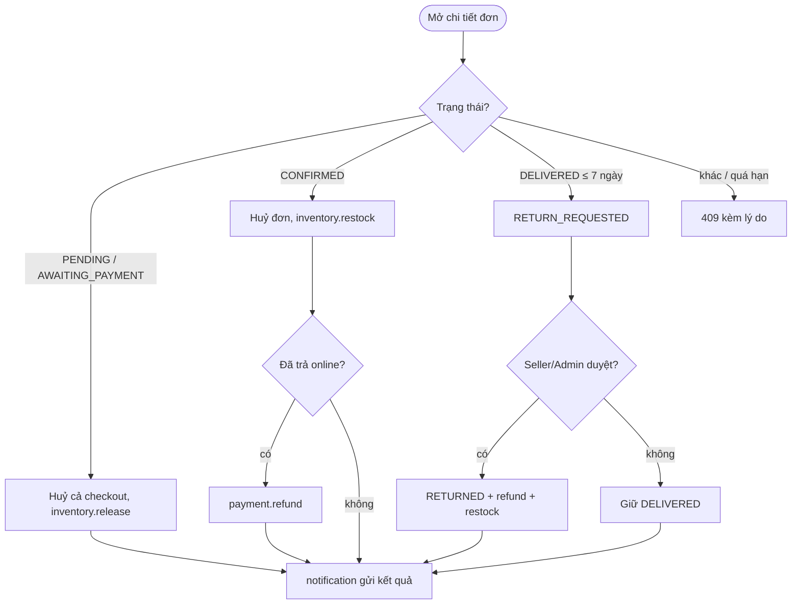
```mermaid
flowchart TD
  a([Mở chi tiết đơn]) --> s{"Trạng thái?"}
  s -- "PENDING / AWAITING_PAYMENT" --> c1["Huỷ cả checkout, inventory.release"]
  s -- CONFIRMED --> c2["Huỷ đơn, inventory.restock"] --> r1{"Đã trả online?"}
  r1 -- có --> rf["payment.refund"]
  r1 -- không --> n
  s -- "DELIVERED ≤ 7 ngày" --> t["RETURN_REQUESTED"] --> d{"Seller/Admin duyệt?"}
  d -- có --> t1["RETURNED + refund + restock"]
  d -- không --> t2["Giữ DELIVERED"]
  s -- "khác / quá hạn" --> x["409 kèm lý do"]
  c1 --> n["notification gửi kết quả"]
  rf --> n
  t1 --> n
  t2 --> n
```

## 18. Hoạt động — Pipeline CI
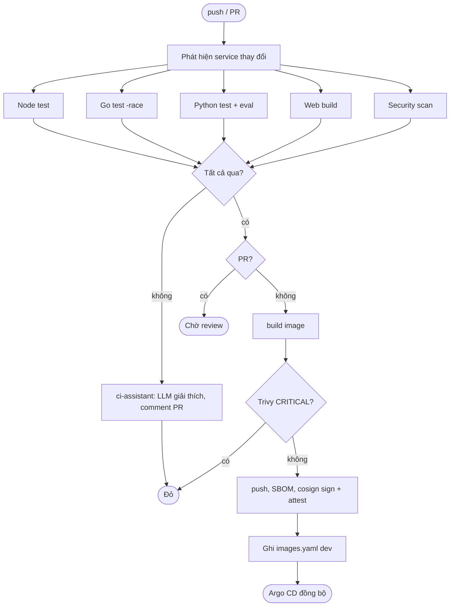
```mermaid
flowchart TD
  a([push / PR]) --> b["Phát hiện service thay đổi"]
  b --> c1["Node test"] & c2["Go test -race"] & c3["Python test + eval"] & c4["Web build"] & c5["Security scan"]
  c1 & c2 & c3 & c4 & c5 --> d{"Tất cả qua?"}
  d -- không --> e["ci-assistant: LLM giải thích, comment PR"] --> z([Đỏ])
  d -- có --> f{"PR?"}
  f -- có --> g([Chờ review])
  f -- không --> h["build image"] --> i{"Trivy CRITICAL?"}
  i -- có --> z
  i -- không --> j["push, SBOM, cosign sign + attest"]
  j --> k["Ghi images.yaml dev"] --> l([Argo CD đồng bộ])
```

## 19. Hoạt động — Vòng lặp AIOps
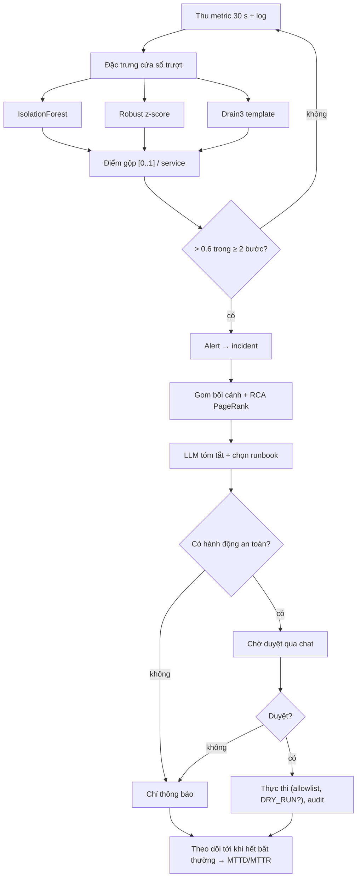
```mermaid
flowchart TD
  a["Thu metric 30 s + log"] --> b["Đặc trưng cửa sổ trượt"]
  b --> c1["IsolationForest"] & c2["Robust z-score"] & c3["Drain3 template"]
  c1 & c2 & c3 --> d["Điểm gộp [0..1] / service"]
  d --> e{"> 0.6 trong ≥ 2 bước?"}
  e -- không --> a
  e -- có --> f["Alert → incident"]
  f --> g["Gom bối cảnh + RCA PageRank"]
  g --> h["LLM tóm tắt + chọn runbook"]
  h --> i{"Có hành động an toàn?"}
  i -- không --> m["Chỉ thông báo"] --> r
  i -- có --> j["Chờ duyệt qua chat"] --> k{"Duyệt?"}
  k -- có --> l["Thực thi (allowlist, DRY_RUN?), audit"] --> r
  k -- không --> m
  r["Theo dõi tới khi hết bất thường → MTTD/MTTR"]
```

## 20. Trạng thái — Đơn hàng
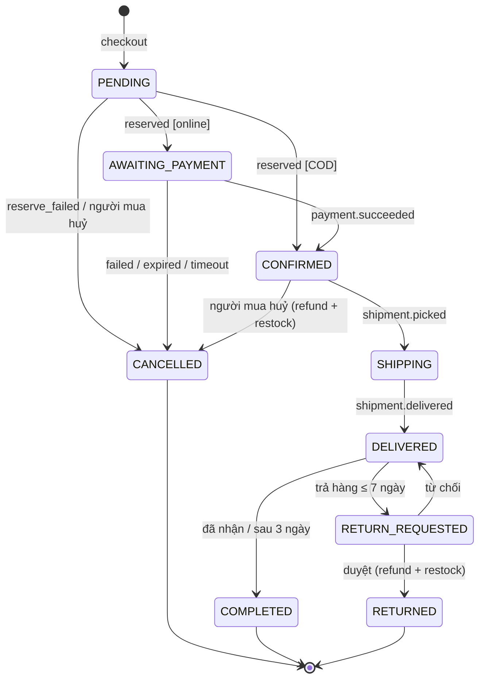
```mermaid
stateDiagram-v2
  [*] --> PENDING: checkout
  PENDING --> AWAITING_PAYMENT: reserved [online]
  PENDING --> CONFIRMED: reserved [COD]
  PENDING --> CANCELLED: reserve_failed / người mua huỷ
  AWAITING_PAYMENT --> CONFIRMED: payment.succeeded
  AWAITING_PAYMENT --> CANCELLED: failed / expired / timeout
  CONFIRMED --> CANCELLED: người mua huỷ (refund + restock)
  CONFIRMED --> SHIPPING: shipment.picked
  SHIPPING --> DELIVERED: shipment.delivered
  DELIVERED --> COMPLETED: đã nhận / sau 3 ngày
  DELIVERED --> RETURN_REQUESTED: trả hàng ≤ 7 ngày
  RETURN_REQUESTED --> RETURNED: duyệt (refund + restock)
  RETURN_REQUESTED --> DELIVERED: từ chối
  CANCELLED --> [*]
  COMPLETED --> [*]
  RETURNED --> [*]
```

## 21. Trạng thái — Thanh toán, vận đơn, giữ kho, sản phẩm, shop
```mermaid
stateDiagram-v2
  state Payment {
    [*] --> P_PENDING: payment.request
    [*] --> PENDING_COD: COD
    P_PENDING --> SUCCEEDED: callback hợp lệ
    P_PENDING --> FAILED: thất bại
    SUCCEEDED --> REFUNDED: refund (1 lần / đơn)
    PENDING_COD --> COLLECTED: order.completed
  }
  state Shipment {
    [*] --> CREATED
    CREATED --> PICKED
    CREATED --> S_CANCELLED: order.cancelled
    PICKED --> IN_TRANSIT
    IN_TRANSIT --> SH_DELIVERED
    IN_TRANSIT --> SH_FAILED
  }
  state Reservation {
    [*] --> RESERVED
    RESERVED --> COMMITTED: commit
    RESERVED --> RELEASED: release
    RESERVED --> EXPIRED: sweeper
    COMMITTED --> RESTOCKED: restock
  }
  state Product {
    [*] --> DRAFT
    DRAFT --> PR_PENDING: gửi duyệt
    PR_PENDING --> APPROVED
    PR_PENDING --> REJECTED
    REJECTED --> DRAFT: sửa
    APPROVED --> HIDDEN
    HIDDEN --> PR_PENDING
  }
  state Shop {
    [*] --> SP_PENDING
    SP_PENDING --> SP_APPROVED: role seller
    SP_PENDING --> SP_REJECTED
    SP_REJECTED --> SP_PENDING
    SP_APPROVED --> SUSPENDED
    SUSPENDED --> SP_APPROVED
  }
```

## 22. Trạng thái — Sự cố AIOps
```mermaid
stateDiagram-v2
  [*] --> OPEN: alert (detected_at)
  OPEN --> DIAGNOSED: RCA + LLM
  DIAGNOSED --> AWAITING_APPROVAL: có hành động
  DIAGNOSED --> MANUAL: không có hành động an toàn
  AWAITING_APPROVAL --> EXECUTING: duyệt
  AWAITING_APPROVAL --> MANUAL: từ chối / hết hạn
  EXECUTING --> MITIGATED: thực thi OK
  EXECUTING --> MANUAL: lỗi
  MITIGATED --> RESOLVED: chỉ số bình thường
  MANUAL --> RESOLVED
  RESOLVED --> [*]
```

## 23. Triển khai — Hybrid
```mermaid
flowchart LR
  subgraph gh["GitHub"]
    r1["shop-microservice"] --> act["Actions"]
    act --> ghcr[("GHCR")]
    r2["shop-gitops"]
    r3["DevOps_Scripts"]
  end
  subgraph onp["Data center on-prem · Proxmox"]
    lb["HAProxy + keepalived VIP"] --> rke["RKE2 HA 3 CP + 3 worker"]
    argo["Argo CD HUB"]
    harbor[("Harbor")]
    dataB[("CNPG · Strimzi · Redis · Mongo · MinIO")]
    rke --- argo
    rke --- dataB
  end
  subgraph aws["AWS ap-southeast-1 · VPC 3 AZ"]
    alb["ALB"] --> eks["EKS on-demand + spot"]
    rds[("RDS Multi-AZ")]
    ec[("ElastiCache")]
    ecr[("ECR")]
    s3[("S3 + CloudFront")]
    eks --- rds & ec & s3
  end
  act -->|cosign copy| ecr
  act -->|mirror| harbor
  act -->|images.yaml| r2
  argo -->|pull| r2
  argo -->|sync prod-onprem| rke
  argo -->|sync prod-aws| eks
  r3 -. terraform + ansible .-> onp
  r3 -. terraform .-> aws
```

## 24. Triển khai — AWS
```mermaid
flowchart TB
  user(["Người dùng"]) --> cf["Route53 · CloudFront · WAF"]
  subgraph vpc["VPC 10.20.0.0/16 · 3 AZ"]
    subgraph pub["Public subnets"]
      alb["ALB"]
      nat["NAT GW ×1 dev / ×3 prod"]
    end
    subgraph priv["Private subnets"]
      ng1["Node group system · on-demand"]
      ng2["Node group workload · spot"]
    end
    subgraph db["Database subnets 10.20.64.0/20"]
      rds[("RDS PostgreSQL 16")]
      redis[("ElastiCache Redis TLS")]
    end
    vpce["VPC endpoints: S3 · ECR · STS · Secrets Manager"]
  end
  cf --> alb --> ng2
  cf --> s3[("S3 media · OAC")]
  ng2 --> rds & redis & vpce
  vpce --> ecr[("ECR")]
  ng1 --> nat
  iam["IAM: GitHub OIDC role · IRSA cho ESO/LBC/S3/Bedrock"]
```

## 25. Triển khai — On-prem
```mermaid
flowchart TB
  subgraph px["Proxmox VE"]
    lb["lb-1, lb-2 · HAProxy + keepalived<br/>VIP :6443 :80 :443"]
    cp["cp-1..3 · RKE2 server · etcd · CIS<br/>snapshot → MinIO"]
    wk["wk-1..3 · RKE2 agent · Longhorn"]
    tools["tools-1 · Harbor + GitHub runner"]
  end
  lb -->|6443| cp
  lb -->|80/443 ingress-nginx| wk
  cp --- wk
  wk -->|pull image| tools
  note["MetalLB · Longhorn 3 bản sao · Vault → External Secrets"]
  wk --- note
```

## 26. Mạng & bảo mật
```mermaid
flowchart LR
  inet["Internet"] --> edge["WAF / CloudFront · TLS"]
  edge --> ing["Ingress controller"]
  subgraph ns["namespace shopnow · NetworkPolicy default-deny"]
    gw["api-gateway<br/>JWT · rate limit"] --> svc["service tier<br/>tự verify JWT · /internal cần token"]
    svc --> data["data tier<br/>chỉ service sở hữu"]
  end
  ing --> gw
  svc --> obs["observability<br/>OTLP 4318"]
  obs --> aiops["aiops<br/>RBAC tối thiểu"]
  aiops -->|rollback / scale có duyệt| svc
  ky["Kyverno admission<br/>Cosign · non-root · no latest · limits"] -.-> ns
  sec["Vault / AWS SM → External Secrets"] -.-> svc
```

## 27. Topo sự kiện Kafka
```mermaid
flowchart LR
  identity --> t1[["identity.user.v1"]] --> up["user-profile"] & nt["notification"]
  seller --> t2[["seller.shop.v1"]] --> identity2["identity"] & catalog2["catalog"] & nt
  catalog --> t3[["catalog.product.v1"]] --> sr["search"] & inv2["inventory"] & ai["ai-service"]
  order --> t4[["inventory.command.v1"]] --> inv2
  inventory --> t5[["inventory.event.v1"]] --> order2["order"] & sr
  order --> t6[["payment.command.v1"]] --> pay2["payment"]
  payment --> t7[["payment.event.v1"]] --> order2 & nt
  order --> t8[["order.v1"]] --> ct["cart"] & pm["promotion"] & sh2["shipping"] & pay2 & rv["review"] & nt & catalog2 & ai
  shipping --> t9[["shipping.v1"]] --> order2 & nt
  review --> t10[["review.v1"]] --> catalog2 & nt
```

## 28. Đường ống quan sát
```mermaid
flowchart LR
  app["15 service<br/>OTel SDK · prom-client · log JSON"] -->|OTLP| col["OTel Collector<br/>k8sattributes · batch<br/>spanmetrics · servicegraph"]
  app -->|/metrics| prom[("Prometheus / Mimir")]
  app -->|stdout| loki[("Loki")]
  col --> tempo[("Tempo")]
  col --> prom
  col --> loki
  prom & loki & tempo --> graf["Grafana<br/>RED · saga · Kafka · AIOps · SLO"]
  slo["Sloth SLO"] --> prom
  prom --> am["Alertmanager"]
  ai["aiops"] -->|query_range| prom & loki
  ai -->|alert source=aiops| am
  am -->|webhook| ai
```

## 29. Kế hoạch (Gantt)
```mermaid
gantt
  title Kế hoạch thực hiện khoá luận (16 tuần)
  dateFormat YYYY-MM-DD
  axisFormat %d/%m
  section Phân tích
  Khảo sát v1, đặc tả         :a1, 2026-09-07, 7d
  Thiết kế, hợp đồng sự kiện  :a2, after a1, 7d
  section Ứng dụng
  Platform lib + identity/catalog         :b1, after a2, 14d
  Saga order/payment/inventory/promotion  :b2, after b1, 14d
  Search, cart, shipping, review, notif   :b3, after b2, 14d
  Web 3 cổng                              :b4, after b1, 21d
  section Nền tảng
  IaC AWS + on-prem       :c1, after a2, 14d
  CI DevSecOps + GitOps   :c2, after c1, 14d
  Quan sát + SLO          :c3, after c2, 7d
  section AIOps & đánh giá
  Detector + RCA + agent  :d1, after c3, 14d
  Chaos + eval + DORA     :d2, after d1, 7d
  Viết báo cáo, slide     :d3, after d2, 14d
```

## 30. Bản đồ công nghệ
```mermaid
mindmap
  root((ShopNow v2))
    Ứng dụng
      Node 22 · TypeScript · Fastify
      Go 1.23 inventory
      Python 3.13 FastAPI
      Next.js 15 · Tailwind v4
      PostgreSQL · Redis · MongoDB · OpenSearch · S3
      Kafka outbox inbox DLQ
    DevSecOps
      GitHub Actions
      Gitleaks · Semgrep · Trivy · Sonar · ZAP
      Syft SBOM · Cosign · Kyverno
      Argo CD ApplicationSet · Argo Rollouts
      Helm · External Secrets
    Hạ tầng hybrid
      Terraform AWS VPC EKS RDS ElastiCache ECR
      Proxmox · Ansible · RKE2
      kind lab
    Quan sát & AIOps
      OpenTelemetry · Prometheus · Loki · Tempo · Grafana
      Sloth SLO · Alertmanager
      IsolationForest · robust z · Drain3
      PageRank RCA · LLM agent
      Chaos Mesh · k6 · DORA
```
